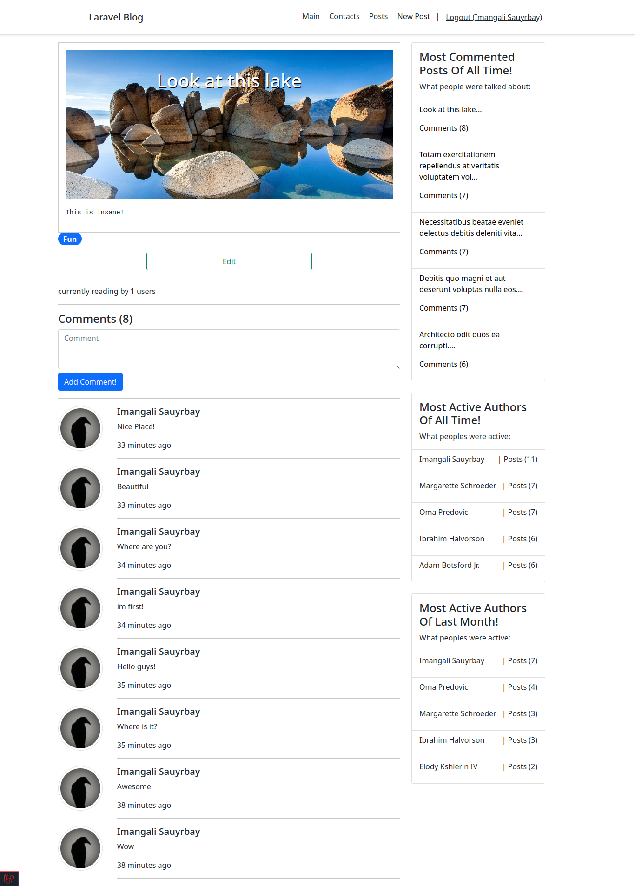

# Blog post web app

This web app is created solely for educational purposes and entertainment. It is not designed to discriminate, promote hate, or abuse anyone in any way. I encourage users to explore, modify, copy, and adapt the content and features within the bounds of respect and ethical behavior. Feel free to experiment, make changes, and use the resources available here in a responsible and creative manner.

## Learning Laravel

Laravel has the most extensive and thorough [documentation](https://laravel.com/docs) and video tutorial library of all modern web application frameworks, making it a breeze to get started with the framework.

If you don't feel like reading, [Laracasts](https://laracasts.com) can help. Laracasts contains over 2000 video tutorials on a range of topics including Laravel, modern PHP, unit testing, and JavaScript. Boost your skills by digging into our comprehensive video library.
